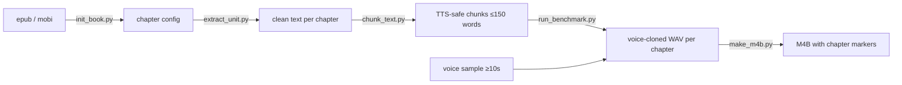

# muze-audiobook

Convert an epub or mobi ebook into a voice-cloned audiobook with chapter
markers, running entirely on local models.

🎧 **Hear it first:** [demo/sample_output/oshidori-excerpt.mp3](demo/sample_output/oshidori-excerpt.mp3)
— a story from Lafcadio Hearn's *Kwaidan*, narrated by a voice cloned from a
~20-second public-domain sample.

## Why

Most books never get an audiobook. Human narration is expensive, and stock
TTS voices are flat. This pipeline clones a narration style from a short
voice sample and generates a complete, chaptered M4B you can drop into Apple
Books — for the cost of your own GPU time. It is one component of **Muze**,
a personal-AI-audio platform concept I'm building toward (personalized
podcasts, social audio sharing).

## How it works



1. **init_book.py** parses the ebook's NCX table of contents, filters
   boilerplate (cover, TOC, index…), and writes a per-book config.
2. **extract_unit.py** pulls clean text from each chapter's XHTML.
3. **chunk_text.py** splits text at paragraph boundaries into ≤150-word
   chunks — sized so no chunk ever exceeds the TTS model's token ceiling —
   with sentence-level regrouping for oversized paragraphs and
   abbreviation-aware sentence splitting.
4. **run_benchmark.py** loads [Chatterbox TTS](https://github.com/resemble-ai/chatterbox)
   once and generates all selected chapters, cloning the narrator from a
   reference sample. A variant system lets you benchmark voices/parameters
   on a short excerpt before committing GPU-hours to the full book.
5. **make_m4b.py** concatenates chapter WAVs with ffmpeg into a single M4B
   with chapter markers and cover art.

## Design decisions

- **Local models over API TTS.** A full book is hours of audio; per-character
  API pricing makes that expensive per book, while a local Chatterbox run
  costs only electricity. Trade-off: you need an NVIDIA GPU.
- **Benchmark-then-produce workflow.** Voice quality is subjective, so the
  pipeline separates cheap exploration (many variants of one short excerpt)
  from expensive production (one chosen variant across the whole book).
- **Chunking is where TTS pipelines fail quietly.** Long inputs get silently
  truncated mid-sentence. Chunks stay ≤150 words (~1500 speech tokens,
  comfortably under the model's 4096 ceiling), and the chunker respects
  paragraph and sentence boundaries so prosody stays natural.
- **Single model load.** Loading TTS weights takes longer than generating a
  short chapter; the production runner loads once and streams every selected
  chapter through, caching voice conditionals after the first chunk.
- **Bleeding-edge GPU support.** RTX 50-series (Blackwell, SM 12.0) needs
  CUDA 12.8 wheels that upstream pins don't provide — the install docs
  include the override, and the runner falls back to CPU when CUDA kernels
  are incompatible.

## Quick start

Requirements: Python 3.11+, ffmpeg, and ideally an NVIDIA GPU (CPU works but
is slow).

```bash
git clone https://github.com/bigbowlz/muze-audiobook.git
cd muze-audiobook
python3 -m venv venv-tts && source venv-tts/bin/activate
pip install -r requirements.txt
# RTX 50-series (Blackwell) GPUs only:
pip install torch==2.7.1 torchaudio==2.7.1 --index-url https://download.pytorch.org/whl/cu128

./demo/run_demo.sh
```

The demo generates ~2 minutes of a *Kwaidan* story with the bundled
public-domain narrator sample. First run downloads Chatterbox weights
(~2 GB). Everything in the demo is public domain: the text is
[Project Gutenberg #1210](https://www.gutenberg.org/ebooks/1210), and the
narrator sample is trimmed from a
[LibriVox recording](https://librivox.org/kwaidan-stories-and-studies-of-strange-things-by-lafcadio-hearn/).

## Producing a full audiobook

```bash
# 1. Add your book and a voice sample (≥10 s clean speech)
cp YourBook.epub source_media/books/
cp your_voice.wav source_media/voices/
# register the voice in configs/voices.json (created from
# voices.json.example on first demo run)

# 2. Generate the chapter config — prints detected chapters for review
python3 scripts/init_book.py --source source_media/books/YourBook.epub

# 3. Benchmark voices on one chapter, pick a winner, set it in units.json
python3 scripts/run_benchmark.py --book your-book-slug --unit unit0 --phase 2

# 4. Produce (interactive chapter selector)
python3 scripts/extract_unit.py --book your-book-slug
python3 scripts/chunk_text.py  --book your-book-slug
python3 scripts/run_benchmark.py --book your-book-slug --phase 2 --production

# 5. Package as M4B with chapter markers
python3 scripts/make_m4b.py your-book-slug --title "Your Book" --author "Author"
```

TTS parameters per variant: `exaggeration` (emotional expressiveness),
`cfg_weight` (guidance strength; lower = more natural), `temperature`
(sampling randomness).

**Copyright note:** your books, voice samples, and generated audio stay in
gitignored paths (`source_media/`, `configs/books/`, `data/`, `output/`).
Only use voice samples and texts you have the rights to. A pre-commit guard
is included: `git config core.hooksPath .githooks`.

## Tests

```bash
pytest tests/ -v
```

Covers text cleaning, marker-based extraction, abbreviation-aware sentence
splitting, chunk regrouping, config resolution, and output naming.

## Limitations & roadmap

- Chapter detection relies on the ebook's NCX table of contents; books with
  malformed TOCs need manual `units.json` edits.
- English-focused: chunking heuristics (abbreviations, caps normalization)
  assume English text.
- Single-narrator per chapter; no dialogue voice switching (planned).
- Roadmap: ASR-based QA pass (transcribe output, diff against source to
  catch dropped sentences), automatic voice-sample loudness normalization,
  and integration into the broader Muze platform.

## License

MIT — see [LICENSE](LICENSE). Bundled demo content is public domain.
